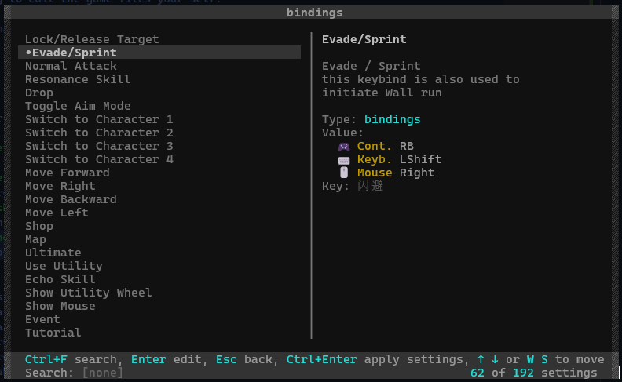

# wuwa-editor

An advance setting editor for Wuthering Waves, that allows you to change the any settings of the game without having to edit the game files your self.

This program aims to make it easier to change settings that would normally be inaccessible through in-game settings.

## Features
let's quickly get over the features of this program.

- **Change any Game Setting**: you can change any setting in the game, even the ones that are not accessible through the in-game settings.
- **Backup and Restore**: the program will automatically backup the game settings before changing them, and you can restore them at any time through the **Restore Backup** menu.
- **Automatic Game Path Detection**: the program will automatically detect game installation path for you, so you don't have to worry about finding it yourself.
- **Descriptive Settings**: have no idea what a setting does? don't worry, the program will give you a description of most settings.
- **Settings Search**: you can search for a setting by name & description, so you don't have to scroll through pages of settings even if you don't know exactly what you are looking for.

## Installation
unfortunately, the program is not yet available as an executable, so you will have to (kinda) build it yourself.

but DON'T WORRY, you don't have to touch any code or command line, just a few clicks (and double) and you are done.

## Background
As in the `1.0.0` version of the game, the 120 FPS setting was removed from the game, and the only way to change it was to edit the game Database file,
so I decided to find a way to edit the game settings directly.
to no surprise, the process isn't as simple as editing a text file,
since some settings are stored in a binary file and even if you manage to edit them it would be difficult to know what you are changing (some settings are written in Chinese).

