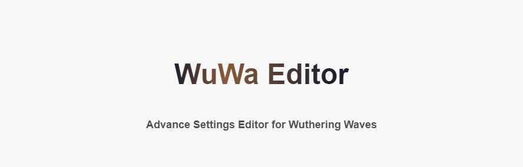
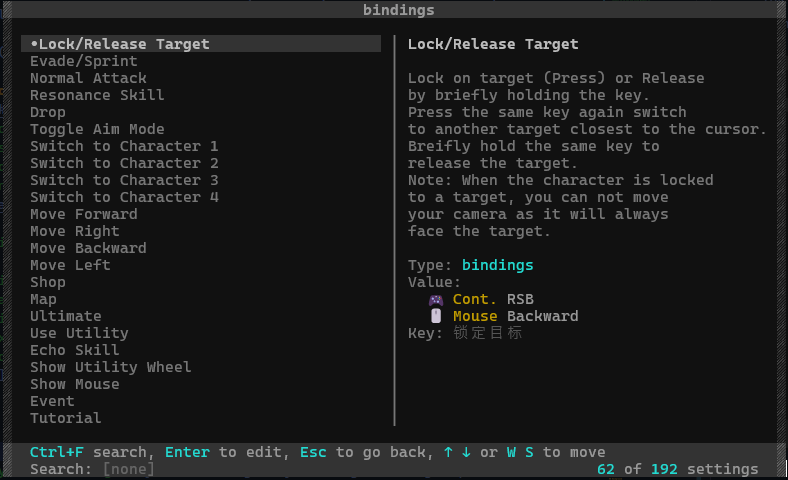
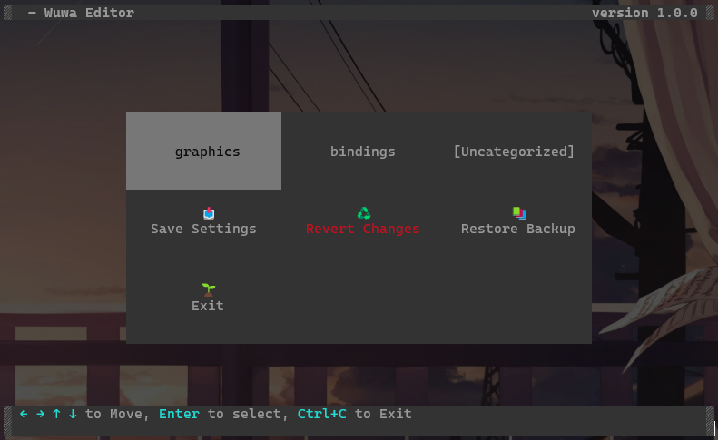
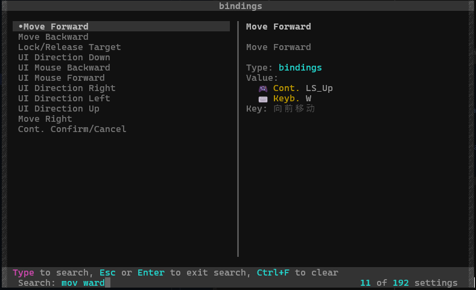
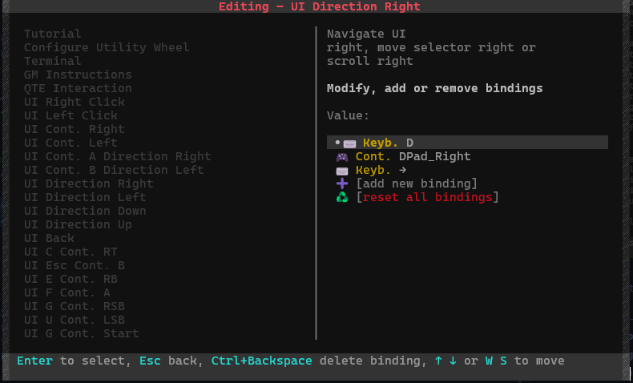
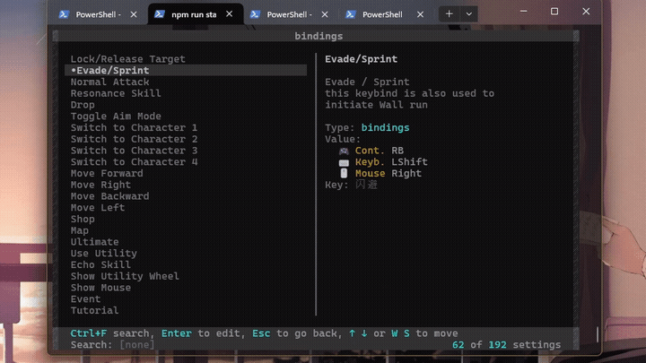
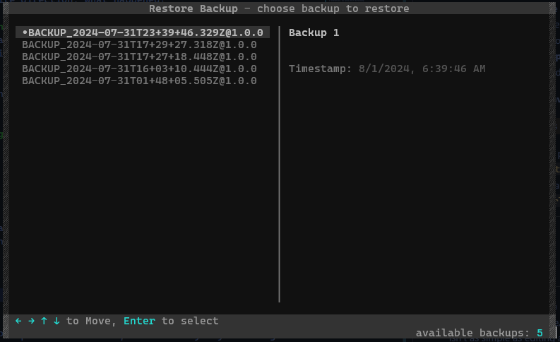

# wuwa-editor

   

banner made with <a herf="https://github.com/rmariuzzo/github-banner">github-banner</a>

An advance setting editor for Wuthering Waves, that allows you to change any settings of the game without having to edit the game files your self.

This program aims to make it easier to change settings that would normally be inaccessible through in-game settings.

## 🔎 Table of Contents
- [💫Features](#-features)
- [📥Installation](#-installation)
  - [Prerequisites](#prerequisites)
  - [1. Download the Program](#1-download-the-program)
  - [2. Run Install Script](#2-run-install-script)
- [📖Usage](#-usage)
   - [Run the Program](#run-the-program)
   - [The Basics](#the-basics)
      - [Main Menu](#-main-menu)
      - [Settings Menu](#settings-menu)
         - [Navigation](#--navigation)
         - [Edit Bindings](#editing---bindings)
         - [Edit Axis (Axis-type Bindings)](#editing---axis-axis-type-bindings)
      - [Restore Backup](#-restore-backup)
- [🌌Background](#-background)

## 💫 Features
let's quickly get over the features of this program.

- **Change any Game Setting**: you can change any setting in the game, even the ones that are not accessible through the in-game settings.
- **Backup and Restore**: the program will automatically backup the game settings before changing them, and you can restore them at any time through the **Restore Backup** menu.
- **Automatic Game Path Detection**: the program will automatically detect game installation path for you, so you don't have to worry about finding it yourself.
- **Descriptive Settings**: have no idea what a setting does? don't worry, the program will give you a brief description of most settings.
- **Settings Search**: you can search for a setting by name & description, so you don't have to scroll through pages of settings even if you don't know exactly what you are looking for.

## 📥 Installation
unfortunately, the program is not yet available as an executable, so you will have to (kinda) build it yourself.

but DON'T WORRY, no need to touch any code or command line, just a few clicks (and double) and you are done.

### Prerequisites
to run this program, here is what you need:
- [Node.js](https://nodejs.org/)
- [Windows Terminal](https://apps.microsoft.com/detail/9n0dx20hk701?hl=en-US&gl=US) (optional)

that's it, after installing **Node.js**, you are ready to go.

> **Note**: for the best experience, I recommend using Windows Terminal, but you can use any terminal you like.

> [!NOTE]
> Windows Terminal is pre-installed on Windows 11, so you don't need to install it if you are using Windows 11.

### 1. Download the Program

donload this project as a zip file by clicking on the green `Code` button then `Download ZIP`.

after downloading, extract the zip file to a folder of your choice.

### 2. Run Install Script

inside the extracted folder, double click and run `install.bat` to install the program.

the script will create a shortcut named "launcher" in this folder, double click on it to run the program.

> **Note**: if you change the folder name or location, you *might* have to run the `install.bat` script again. (the launcher will ask you to do so, if it failed to locate the program folder)

> [!IMPORTANT]
> this program REQUIRES administrative privileges to function. **the launcher will automatically launch the program as administrator for you.**

## 📖 Usage

### Run the Program

to run the program simply **double-click on the shortcut named "launcher"** in the program folder.

or alternatively, you can do one of the following:

1. right-click on `wuwa-editor.bat` and run as administrator.

2. run `npm run start` on the root directory of the program. **(make sure the terminal is elevated)**

> **Note**: *"terminal"* is just a fancy word for **Command Prompt** (CMD) or **PowerShell**. you can use anything you like.

----------------------------

### The Basics

#### # Main Menu
when you run the program, you will be greeted with Main menu, all the navigation is done here.
you can navigate through the program using the **arrow keys**, and select an option by pressing `Enter`.

the top three tiles are settings separated in categories. with `[Uncategorized]` as a special category for settings that doesn't belong to any category.

a quick rundown for the rest of the options:
- **Save Settings** - save the changes you made to the game settings. (changes you made will not take effect until you save them.)
- **Revert Changes** - discard any changes you made **before** saving. if you already saved the changes, you can restore them using the **Restore Backup** option.
- **Restore Backup** - restore the game settings to any backup automatically created.

------------------------

#### # **Settings Menu**
when you select a category, you will be taken to the settings menu, here only the settings of the selected category will be shown.

------------------------

##### - **Navigation**

you can navigate through the settings using the **arrow keys** or `W A S D`, and edit a setting by pressing `Enter`.

> from any menu, you can **exit the program** by pressing `Ctrl+C`.

can't find the setting you are looking for? press `Ctrl+F` to search for a setting by name and description.

only the settings that match will be shown, **sorted by relevance**. to navigate through the search results, press `Esc` or `Enter` to exit search before you can use the arrow keys.

> **Note**: the search is case-insensitive and will match any part of the setting name or description.

There are 6 types of settings:
- **bool** - boolean, can be either `true` or `false`. (toggle value by pressing `Space`)
- **number** - a number value as Integer or Float.
- **string** - a string value.
- **enum** - a choices to select from a list of values.
- **bindings** - key bindings for key presses, mouse buttons, and controller buttons. multiple keys can be bound to a single action.
- **axis** - similar to **bindings**, but for analog inputs like mouse movement and controller sticks.

of the 6 types, **bindings** and **axis** are the most complicated to work with, so I will explain them in more detail.

first when you select a setting of type **bindings** or **axis**, you will able to select any of the **values** already bound to this action along with **and new binding** and **reset all bindings** options.

selecting any of the **values** to edit them

##### Editing - **Bindings**

there are 3 pages when editing a **binding**

1. edit, add, remove bindings or apply all bindings to current setting. (the image above)
2. select device type (keyboard, mouse, controller, modifier)
3. select a key or button to bind

page 3 is where you actually select a key or button, what you select where will show up at the bottom of the screen.
after that, you can select more keys or modifiers then press `Ctrl+Enter` to apply the current binding. which will take you back to page 1, with values being updated or added.

you can then press `Esc` to go back to the settings menu and edit other settings.
the changes you just made will automatically be applied (but not saved, you have to do that on the **Main menu**)

> [!NOTE]
> **Differences between `apply` and `save`**
> - ***apply*** - the editor remembers the changes you made, but will not take effect until you save them. in this state, you can revert the changes you made with **Revert Changes** option.
> - ***save*** - the changes you have applied are saved (written) to the Game settings file, and will take effect the next time you run the game. **Revert Changes** can not revert changes made after saving. you have to restore them with **Restore Backup**.
>
> the **applied** settings will be marked with `[M]` at the end of the setting name.

still confused? let's go through an example.

say we want to change the a binding to keyboard `Ctrl+F+E`, here is how you do it:

1. [page1] select any binding you what to change (to add new one, select `and new binding`).
2. [page2] select `keyboard` as the device type.
3. [page3] press `Ctrl+G` to enter key recording mode, then press `F`
4. [page3] press `Ctrl+G` again, then press `E`
5. [page3] where still missing `Ctrl` modifier, let's go back to step 2 by pressing `Esc`
6. [page2] now select `modifier` as the device type.
7. [page3] and select `Ctrl` as a modifier key.
8. [page3] press `Ctrl+Enter` to apply the binding. (done)

##### Editing - **Axis** (Axis-type Bindings)

editing an **axis** is similar to **bindings**, but an additional step to select **input type** (not to be confused with **device type**).

there are 3 pages when editing a **axis**

1. edit, add, remove (axis-type) bindings or apply all bindings to current setting. (the image above)
2. select input type **Binding**, **Axis** or **Set Scaling** (not exactly an input type, ik but bear with me)
3. select device type (keyboard, mouse, controller)
4. select a **key**, **button** or **axis** to bind

> **Note**: selecting **input type** to **Binding** allows you to bind a non-analog input to an analog action
> for example, this game allows you to move around in the Map using `W A S D` keys and those keys are bound to the same **axis-type bindings** as the Mouse and Controller.
> Changing **Scaling** will also change how aggressive the Map moves when pressing the keys.

let's go through a couple of examples together.

say we want to set a binding to be a **scroll wheel** (`MouseWheel`) with scaling of 80% (because you find it a little too fast), here is how you do it:

1. [page1] select any binding you what to change (to add new one, select `and new binding`).
2. [page2] select `Axis` as the input type.
3. [page3] select `mouse` as the device type.
4. [page4] select axis `MouseWheel` as the input. and go back to page 2 by pressing `Esc`
5. [page2] select `Set Scaling`.
6. [page2] the program will prompt you to enter a scaling value, enter `80` and press `Enter`.
7. [page2] press `Ctrl+Enter` to apply the binding. (done)

next, let say you've set the `↑` (up arrow) key to pan the camera up (scaling is `40%`), however when tested in-game, the camera moves in the opposite direction, what happened?

this is because the **game sees the action of paning the camera as a whole y-axis movement**,
for the actual analog input devices (like mouse and controller) this is not a problem since, it has both **positive** and **negative** values to indicate direction of the movement. (basically, a Vector)
what about the keyboard? it only has two states, **pressed** and **not pressed**, so the game has to decide which direction to move the camera when the key is pressed.
in this case, it's down.

to fix this, you have to **invert** the **scaling** value (in this case from `40%` to `-40%`), let's do it together:

> if your **scaling** value is already negative, just make it positive.

1. [page1] select the problematic `↑` (up arrow) binding.
2. [page2] select `Set Scaling`.
3. [page2] the program will prompt you to enter a scaling value, enter `-40` and press `Enter`.
4. [page2] press `Ctrl+Enter` to apply the binding. (done)

----------------------

#### # **Restore Backup**

the **Restore Backup** option allows you to restore the game settings to any backup created automatically by the program.

in this menu, you will be shown a list of backups, with the most recent one at the top.

press `Enter` to restore the selected backup (**takes effect immediately**).

> [!WARNING]
> this action **cannot be undone** and restoring a backup will **immediately discard any changes** you made **after** the selected backup was created.

## 🌌 Background

As in the `1.0.0` version of the game, the 120 FPS option was removed, and the only way to change to it was to edit game's Database file,
so I decided to find a way to edit the game settings directly.
to no surprise, the process isn't as simple as editing a text file,
since some settings are stored in a binary file and even if you manage to edit them it would be difficult to know what you are changing (some settings are written in Chinese).

